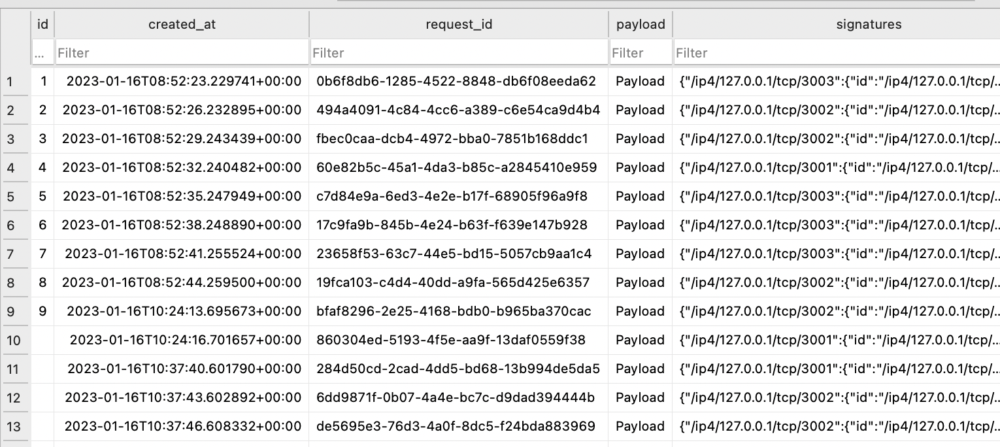

# Scripts

## Output

All output goes to into $PROJECT_ROOT/cluster directory.

* `cluster/db` - sqlite db files
* `cluster/logs` - logs
* `cluster/signatures` - file backend files
* `.pids` - process ids

## Create new cluster

Creates configuration for new cluster of nodes in `~/.ephemera` directory

```bash
./run-local-p2p.sh cluster -n 3
``` 

## Start cluster

Runs _ephemera-signatures-app_ on all nodes in cluster.


```bash
./run-local-p2p.sh run -a ../ephemera-signatures-app
```

## Stop cluster

Stops _ephemera-signatures-app_ on all nodes in cluster

```bash
./run-local-p2p.sh stop
```

## Signatures app backends

* DbBackend - stores signatures in `Sqlite` database
* FileBackend - stores signatures in file
* WsBackend - sends signatures to websocket

## Example websocket output

```bash
andrus@Andruss ~ % websocat ws://127.0.0.1:6001
```

```json
{
  "request":{
    "request_id":"c3af01b3-7768-4e61-90f3-664a3e9c4053",
    "payload":[
      80,
      97,
      121,
      108,
      111,
      97,
      100
    ],
    "signatures":{
      "/ip4/127.0.0.1/tcp/3003":{
        "id":"/ip4/127.0.0.1/tcp/3003",
        "signature":"4bc58d5bf509010671277ef6bfea323faa97cac060705576b169fc56ffc8902105fc6a7cc606810eb55651c988dddd18834ff7626816ba319de0d73cf6d9a001"
      },
      "/ip4/127.0.0.1/tcp/3004":{
        "id":"/ip4/127.0.0.1/tcp/3004",
        "signature":"a8378c6f73726cc4745c8860dd4786ab6cc6e86c5f2a6596132851eb5b511d2471d9cf8653f65f69096bced8c5112ea8acc164329fd1f309b312b35c4580c50a"
      },
      "/ip4/127.0.0.1/tcp/3001":{
        "id":"/ip4/127.0.0.1/tcp/3001",
        "signature":"db9f3ab9c09b99ef4cb4b3669a104efa2d30b0b75ca02ce6a82ea80a77c538b4c108cc51a97a0ae9f6b9798e660a7298ef045a84702a4b39fb3878ed58f90100"
      },
      "/ip4/127.0.0.1/tcp/3002":{
        "id":"/ip4/127.0.0.1/tcp/3002",
        "signature":"4bc58d5bf509010671277ef6bfea323faa97cac060705576b169fc56ffc8902105fc6a7cc606810eb55651c988dddd18834ff7626816ba319de0d73cf6d9a001"
      }
    }
  }
}
```

## Example database snapshot



## Example file backend output

```text
payload: Payload
signer: /ip4/127.0.0.1/tcp/3003
signature: c0045446c6d9e68e9b9a04fb1d1bc36ada7f68acd3a1d552013a3816ea6397d37466093596650b385cca7aacdcf059d3159a678ab7b23594c4e1ccd4fddc8802
signer: /ip4/127.0.0.1/tcp/3002
signature: 62814e85abae293010efacb5fe02cd29fa20ce677c30253c8305b0ba0b6ad91e97bff6673eed22d05102b9d993c588a1945a6a2367bcb6195dd325e0077be005
signer: /ip4/127.0.0.1/tcp/3001
signature: c4a8be79f57d08ee58a16a01c3ecae7a2c3c22468ccdd9b624acbe4ac3a82d5b96463f4116a02e4bb85a3d84a9667460c7986f1616ab2c6dd0b37d9c8b38950c


payload: Payload
signer: /ip4/127.0.0.1/tcp/3003
signature: c0045446c6d9e68e9b9a04fb1d1bc36ada7f68acd3a1d552013a3816ea6397d37466093596650b385cca7aacdcf059d3159a678ab7b23594c4e1ccd4fddc8802
signer: /ip4/127.0.0.1/tcp/3001
signature: c4a8be79f57d08ee58a16a01c3ecae7a2c3c22468ccdd9b624acbe4ac3a82d5b96463f4116a02e4bb85a3d84a9667460c7986f1616ab2c6dd0b37d9c8b38950c
signer: /ip4/127.0.0.1/tcp/3002
signature: 62814e85abae293010efacb5fe02cd29fa20ce677c30253c8305b0ba0b6ad91e97bff6673eed22d05102b9d993c588a1945a6a2367bcb6195dd325e0077be005
```
